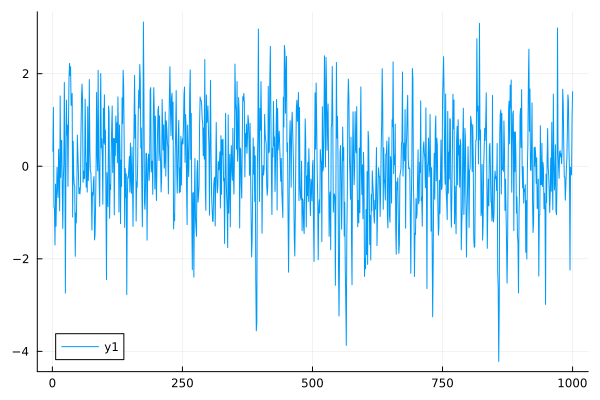
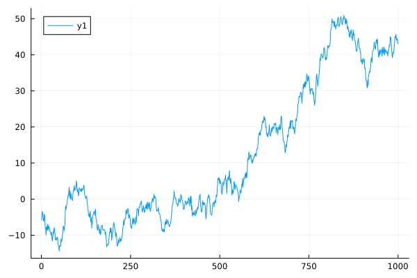
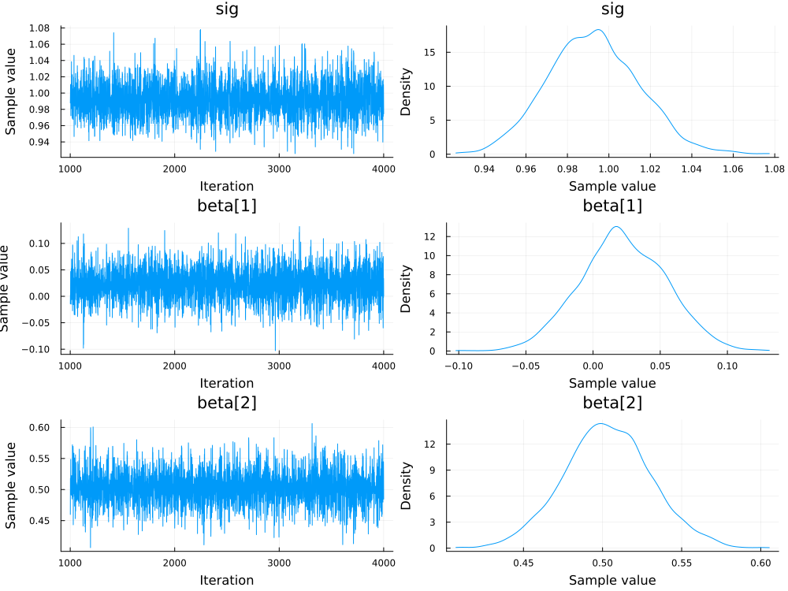
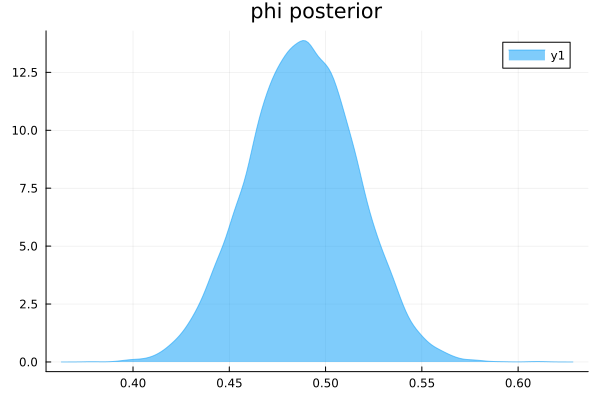
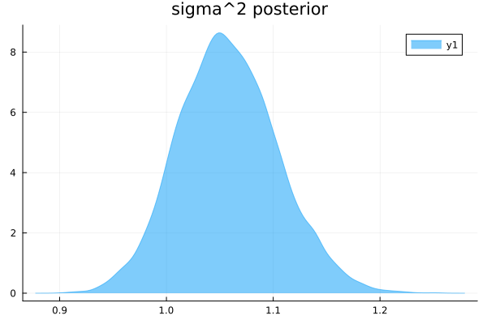

# ECON 9011 Assignment 1
## Author: Ang Zhang

### 1. Give an equation for the likelihood function of an AR(1) model.

An AR(1) model can be specified as: $X_{t+1} = \alpha + \phi*X_t + \epsilon_t$, where $\epsilon \sim N(0,\sigma^2)$. Assue no drift, i.e. $\alpha = 0$.  Then $ X \sim N(\phi x_{t-1}, \sigma^2)$. The multiplication rule says: 
$$
f(x_1, x_2, \cdots, x_n)=f(x_1)f(x_2|x_1)\cdots f(x_n|x_1,x_2,\cdots,x_{n-1})
$$
Then the likelihood function:
$$
L(\phi, \sigma^2 | x) = P(x|\phi, \sigma^2) = \frac{1}{(\sqrt{2\pi\sigma^2})^n}exp(-\frac{\sum{(x_i - \phi x_{i-1})^2}}{2\sigma^2})
$$
### 2. Write down suitable (relatively) uninformative priors for an AR(1) model (give equations). 
$\phi$ could be anywhere on the real line. $\sigma^2$ would be greater than 0. Assume uniform prior for both parameters. and suppose c is a relative large number, So:
$$
p(\phi) \propto 1, -c<\phi<c
$$
$$
p(\sigma^2) \propto 1, 0<\sigma^2<c
$$

### 3. Using the above likelihood and priors, give an equation for each of the conditional posterior densities of each parameter of an AR(1) model up to a constant of proportionality. 

From our prior, both parameters are propostional to 1 in their respective range, so the posterior density would be:
$$
p(\phi, \sigma^2 | x) \propto Lp(\phi)p(\sigma^2)\propto L
$$
So, for conditional posterior density of $\phi$ we treat $\sigma^2$ as constant:
$$
p(\phi|\sigma^2,x) \propto \frac{1}{(\sqrt{2\pi\sigma^2})^n}exp(-\frac{\sum{(x_i - \phi x_{i-1})^2}}{2\sigma^2}) \propto \frac{1}{(\sqrt{2\pi\sigma^2})^n}exp(-\frac{\sum{(\phi - something)^2}}{2\sigma^2})
$$
this is also a Normal distribution.
For conditional posterior density of $\sigma^2$ we treat $\phi$ as constant:
$$
p(\sigma^2|\phi,x) \propto \frac{1}{(\sqrt{2\pi\sigma^2})^n}exp(-\frac{\sum{(x_i - \phi x_{i-1})^2}}{2\sigma^2}) \propto (\sigma^2)^{-2/n}exp(-\frac{something}{\sigma^2})
$$
which looks like a Inverted Gamma distribution.
### 4. Based on the above, write down, in detail, an MCMC algorithm for conducting posterior inference for an AR(1) model. 

Step 1: Start with uniformative starting value of $\phi^{(0)}$  
Step 2: Plug in the $\phi$ value into the conditional distribution of $\sigma^2$, then draw a value for $\sigma^2$ from that distribution.  
Step 3: Plug in the $\sigma^2$ value into the conditional distribution of $\phi$, then draw a value for $\phi$ from that distribution.  
Step 4: Repeat above steps for N times (N is large).  
Then we get a distribution of the parameters $\phi$ and $\sigma^2$.

### 5. What is a suitable prior to enforce a stationarity assumption in an AR(1) model, i.e., impose the constraint(s) necessary ensure the variable is stationary? 
Stationary (week form) by definition is that the mean, variance and autocorrelation is constant over time.
For AR(1) model to be stable we have $-1<\phi<1$, then the prior can be:
$$
p(\phi) \propto 
\begin{cases}
    1, -1<\phi<1 \\
    0, all\ else
\end{cases}
$$
### 6. Using Julia, generate pseudo-data for two variables, 100 observations, each from an AR(1) DGP; one stationary, one nonstationary (you can experiment with different parameter values), and provide a time plot for each one. 
let n = 1000
**Stationary:(let $\phi = 0.5$)**
```Julia
phi = 0.5
alpha = 0
z = zeros(n+20)
for t = 2:n+20
    z[t] = alpha + phi*z[t-1] + randn(1)[1]
end
y = z[21:end]
plot(y)

```


**Non-Stationary:(let $\phi = 1.001$)**
```Julia
phi = 1.001
z = zeros(n+20)
for t = 2:(n+20)
    z[t] = 0.0 + phi*z[t-1] + randn(1)[1]
end
y = z[21:(n+20)]
plot(y)
```



### 7. Using Julia and you data generated in qu. 6, estimate an AR(1) model (i) using Bayesian HMC/MCMC methods in Turing.jl, and also (ii) using Gibbs sampling (not via Turing.jl). Provide estimation summary statistics and plots of the posterior densities along with plot and/or information about the prior distributions used. 
**(1)Using Turing.jl**
```Julia
yt = y[2:n]
yt1 = y[1:(n-1)]
X = [ones(n-1) yt1]
using Turing
@model simple_regression(y,X, ::Type{TV}=Vector{Float64}) where {TV} =begin
    n, D = size(X)
    #alpha ~ Normal(0,1)
    sig ~ Uniform(0.01,10)
    #m ~ Truncated(Normal(-2,3),-999.9,0.999)
    beta = TV(undef,(D))
    # sd<10 too restrictive for beta coeffs 
    for k in 1:(D)
        beta[k] ~ Normal(0, 20.0)
    end
    #delta ~ Normal(0,3.0)
 #   mu = logistic.(Matrix(X) * beta)
    for i in 1:n
        y[i] ~ Normal(X[i,:]'*beta, sig)
    end
end

model = simple_regression(yt, X)
Turing.setprogress!(true)
@time cc = sample(model, NUTS(0.65),3000)

cc

plot(cc)
```
** Parameter disstributions:**




Summary Statistics
  parameters      mean       std      mcse    ess_bulk    ess_tail      rhat   ess_per_sec 
      Symbol   Float64   Float64   Float64     Float64     Float64   Float64       Float64 

         sig    0.9925    0.0221    0.0003   4246.3725   2070.5354    1.0002      866.9605
     beta[1]    0.0223    0.0321    0.0005   4977.8410   2198.9361    1.0028     1016.3007
     beta[2]    0.5031    0.0277    0.0004   4540.3554   2170.7153    0.9999      926.9815

Quantiles
  parameters      2.5%     25.0%     50.0%     75.0%     97.5% 
      Symbol   Float64   Float64   Float64   Float64   Float64 

         sig    0.9506    0.9774    0.9924    1.0072    1.0375
     beta[1]   -0.0396    0.0009    0.0212    0.0445    0.0850
     beta[2]    0.4489    0.4848    0.5027    0.5210    0.5592

**(2)Using Gibbs sampling**
Since AR(1) model taken on the same form as a linear model if we set $Y=x$ and $X=x_{t-1}$, we can utilize the *gsreg()* function provided in *gsreg.jl* to do the magic. Since we have to use the first observation as the value for $x_0$, the actual size of the data will be 99. 
In gsreg() function the default starting value for phi is 0 and for sigma is 1.
Code as below: 

```Julia
yt = y[2:end]
yt1 = y[1:end-1]


include("gsreg.jl")

b = [0.0; 0.0]    # prior coeff. means
iB = inv([0.0001 0.0; 0.0 0.0001]) 

X = [ones(99) yt1]
bdraws,s2draws = gsreg(yt,X)

plot(bdraws[:,2], st=:density, fill=true, alpha=0.5, title = "phi posterior")
mean(bdraws[:,2])
std(bdraws[:,2])
quantile(bdraws[:,2],[0.025,0.975])

plot(s2draws[:,1], st=:density, fill=true, alpha=0.5, title = "sigma^2 posterior" )
mean(s2draws[:,1])
std(s2draws[:,1])
quantile(s2draws[:,1],[0.
```
** Distribution for $\phi$  **


 
**mean of $\phi$ is 0.4877, standard error is 0.0279, 95% confidence interval is [0.4330, 0.5411]**
 
**Distribution for $\sigma^2$ **


**mean of $\sigma^2$ is 1.0579, standard error is 0.0466, 95% confidence interval is [0.9708, 1.1540]**
