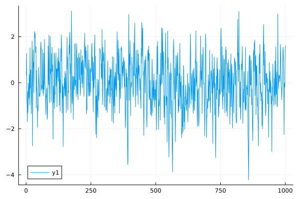
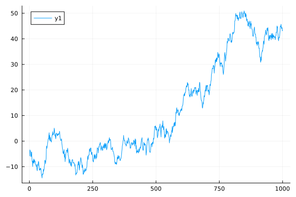
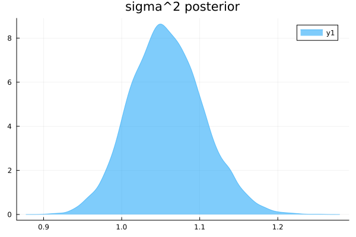

# ECON 9011 Assignment 2
## Author: Ang Zhang

### 1. What is the standard frequentist estimator and distribution of that estimator for an AR(1) model?  What happens to the frequentist estimator for a unit root process (and values of the AR(1) parameter that lead to a characteristic root inside the unit circle)?  Why is it so different in this case? 

Unit root less than one -> characteristic root outside of the unit circle.

### 2. Do a simulation study to show what happens to the distribution of a variable generated by an AR(1) stochastic process over the possible range of the parameter space for the AR(1) coefficient, with special attention to “roots local to unity”, i.e. characteristic roots at and near (either side) of unity. 


### 3. Do a simulation study to show what happens to the distribution of a variable generated by an AR(2) stochastic process over the possible range of the parameter space for the AR(2) coefficients, with special attention to “roots local to unity”, i.e. characteristic roots at and near (either side) of unity. 


### 4. Is the log(CPI) difference stationary or trend stationary (data are in the CPI.csv file)? Provide and discuss (very briefly!) all the evidence. 


### 5. Using Turing.jl, estimate an ARIMA(2,1,1) for log(CPI) (data are in the CPI.csv file).  Report the results (summary statistics for posteriors similar to regression output).  Plot the posterior for the AR(1) coefficient (and save the MCMC draws for the next question). 

ARIMA(p,d,q) for a variable, $y_t$ :

$$
\Delta^dy_t=a+\sum_{i=1}^{p}\phi_t\Delta^dy_{i-1} +\sum_{i=1}^q\theta_t\epsilon_{t-i}+\epsilon_t, \epsilon_t \sim iidN(0,\sigma)
$$
so difference the variable d times first, then include p lags for the difference variable and q lags of the equation error.
write this as:
$$

$$

### 6. Estimate an ARIMA(1,1,2).  Report the results (as above) and plot the posterior for the AR(1) coefficient along with the estimated coefficient from qu. 4, plotted on the same figure for comparison.  Obtain posterior draws for the difference in the two estimates of the AR(1) coefficient and plot that posterior (of the difference). 

let n = 1000
**Stationary:(let $\phi = 0.5$)**
```Julia
phi = 0.5
alpha = 0
z = zeros(n+20)
for t = 2:n+20
    z[t] = alpha + phi*z[t-1] + randn(1)[1]
end
y = z[21:end]
plot(y)

```


**Non-Stationary:(let $\phi = 1.001$)**
```Julia
phi = 1.001
z = zeros(n+20)
for t = 2:(n+20)
    z[t] = 0.0 + phi*z[t-1] + randn(1)[1]
end
y = z[21:(n+20)]
plot(y)
```



### 7. Using Julia and you data generated in qu. 6, estimate an AR(1) model (i) using Bayesian HMC/MCMC methods in Turing.jl, and also (ii) using Gibbs sampling (not via Turing.jl). Provide estimation summary statistics and plots of the posterior densities along with plot and/or information about the prior distributions used. 
**(1)Using Turing.jl**
```Julia
yt = y[2:n]
yt1 = y[1:(n-1)]
X = [ones(n-1) yt1]
using Turing
@model simple_regression(y,X, ::Type{TV}=Vector{Float64}) where {TV} =begin
    n, D = size(X)
    #alpha ~ Normal(0,1)
    sig ~ Uniform(0.01,10)
    #m ~ Truncated(Normal(-2,3),-999.9,0.999)
    beta = TV(undef,(D))
    # sd<10 too restrictive for beta coeffs 
    for k in 1:(D)
        beta[k] ~ Normal(0, 20.0)
    end
    #delta ~ Normal(0,3.0)
 #   mu = logistic.(Matrix(X) * beta)
    for i in 1:n
        y[i] ~ Normal(X[i,:]'*beta, sig)
    end
end

model = simple_regression(yt, X)
Turing.setprogress!(true)
@time cc = sample(model, NUTS(0.65),3000)

cc

plot(cc)
```
** Parameter disstributions:**


Summary Statistics
  parameters      mean       std      mcse    ess_bulk    ess_tail      rhat   ess_per_sec 
      Symbol   Float64   Float64   Float64     Float64     Float64   Float64       Float64 

         sig    0.9925    0.0221    0.0003   4246.3725   2070.5354    1.0002      866.9605
     beta[1]    0.0223    0.0321    0.0005   4977.8410   2198.9361    1.0028     1016.3007
     beta[2]    0.5031    0.0277    0.0004   4540.3554   2170.7153    0.9999      926.9815

Quantiles
  parameters      2.5%     25.0%     50.0%     75.0%     97.5% 
      Symbol   Float64   Float64   Float64   Float64   Float64 

         sig    0.9506    0.9774    0.9924    1.0072    1.0375
     beta[1]   -0.0396    0.0009    0.0212    0.0445    0.0850
     beta[2]    0.4489    0.4848    0.5027    0.5210    0.5592

**(2)Using Gibbs sampling**
Since AR(1) model taken on the same form as a linear model if we set $Y=x$ and $X=x_{t-1}$, we can utilize the *gsreg()* function provided in *gsreg.jl* to do the magic. Since we have to use the first observation as the value for $x_0$, the actual size of the data will be 99. 
In gsreg() function the default starting value for phi is 0 and for sigma is 1.
Code as below: 

```Julia
yt = y[2:end]
yt1 = y[1:end-1]


include("gsreg.jl")

b = [0.0; 0.0]    # prior coeff. means
iB = inv([0.0001 0.0; 0.0 0.0001]) 

X = [ones(99) yt1]
bdraws,s2draws = gsreg(yt,X)

plot(bdraws[:,2], st=:density, fill=true, alpha=0.5, title = "phi posterior")
mean(bdraws[:,2])
std(bdraws[:,2])
quantile(bdraws[:,2],[0.025,0.975])

plot(s2draws[:,1], st=:density, fill=true, alpha=0.5, title = "sigma^2 posterior" )
mean(s2draws[:,1])
std(s2draws[:,1])
quantile(s2draws[:,1],[0.
```
** Distribution for $\phi$  **


 
**mean of $\phi$ is 0.4877, standard error is 0.0279, 95% confidence interval is [0.4330, 0.5411]**
 
**Distribution for $\sigma^2$ **


**mean of $\sigma^2$ is 1.0579, standard error is 0.0466, 95% confidence interval is [0.9708, 1.1540]**
