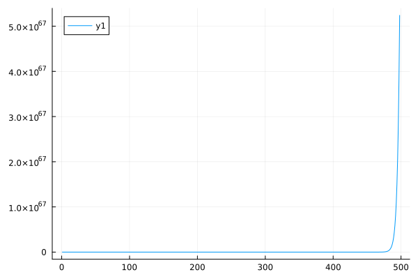
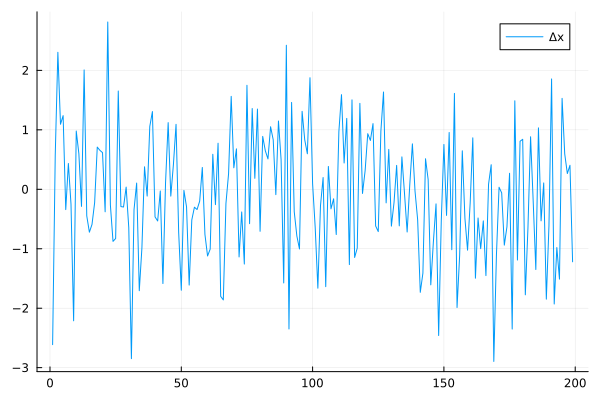

# ECON 9011 Assignment 2
## Author: Ang Zhang

### 1. What is the standard frequentist estimator and distribution of that estimator for an AR(1) model?  What happens to the frequentist estimator for a unit root process (and values of the AR(1) parameter that lead to a characteristic root inside the unit circle)?  Why is it so different in this case? 
An AR(1) model can be specified as: $X_{t+1} = \alpha + \phi*X_t + \epsilon_t$, where $\epsilon \sim N(0,\sigma^2)$.
The standard estimator for a frequentist's estimator of $\phi$ will be an OLS estimator, which usually has the form:
$$
\hat{\beta} = (X^TX)^{-1}X^TY
$$
with it's mean equal to $\phi$ and variance as $\sigma^2(X^TX)^{-1}$.
For an AR(1) model it becomes: 
$$
\hat{\phi} = (X_t^TX_t)^{-1}X_t^TX_{t+1}
$$
and 
$$
\sigma_X^2 = \frac{\sigma^2}{1-\phi^2}
$$
An unit root process means $\phi=1$, then the variance of X leads to infinity. The process become a random walk.

Characteristic root inside of the unit circle means unit root larger than one, which means the process is non-stationary. In that case the standard OLS also does not apply because that would mean $\sigma_X^2$ becomes negative which also don't make sense. 

The difference mainly stems from the fact that for non-stationary process, the variance of the variable does not conform to the underlying assumption of the least square procedure.

### 2. Do a simulation study to show what happens to the distribution of a variable generated by an AR(1) stochastic process over the possible range of the parameter space for the AR(1) coefficient, with special attention to “roots local to unity”, i.e. characteristic roots at and near (either side) of unity. 
Examine the case for $\phi$ equals to 0.5, 0.95, 1.0, 1.05 and 2 respectively. Let $\sigma = 1$ and n = 500.
```Julia
## AR(1) DGP
n = 500
phi = 2
z = zeros(n)
z[1] = 0.1
for t = 2:(n)
    z[t] = phi*z[t-1] + randn(1)[1]
end
#y = z[21:(n+20)]
y = z
plot(y)
mean(y)
plot(y[1:499])
```


### 3. Do a simulation study to show what happens to the distribution of a variable generated by an AR(2) stochastic process over the possible range of the parameter space for the AR(2) coefficients, with special attention to “roots local to unity”, i.e. characteristic roots at and near (either side) of unity. 
Examine the cases for $\phi_1$ and $\phi_2$ are (0.6, 0.4), (0.95, 0.98), (1.0, 0.98), (1.02, 1.05) and  (0.6, 1.05) respectively. Let $\sigma = 1$ and n = 500.
```Julia
n = 500
phi1 = 0.6
phi2 = 1.05
#z = zeros(n+20)
z = zeros(n)
z[1] = 0.1
z[2] = z[1] + randn(1)[1]
for t = 3:(n)
    z[t] = phi1*z[t-1] + phi2*z[t-2]  + randn(1)[1]
end
#y = z[21:(n+20)]
y = z
plot(y)
mean(y)
plot(y[1:498])
```





### 4. Is the log(CPI) difference stationary or trend stationary (data are in the CPI.csv file)? Provide and discuss (very briefly!) all the evidence. 
Load in the data and perform an eyeball examine:
```Julia
df = CSV.read("CPI.csv", DataFrame, header=true)
CPI = df.CPIAUCSL
CPI_Log = log.(CPI)
plot(CPI_Log)
```


Looks like it is not I(0) staionary. Difference it once and look at it again:


Looks like it is I(1) staionary. 
Also through visual inspection it does not look like to be trend stationary, because there doesn't seem to be a stable trend.


### 5. Using Turing.jl, estimate an ARIMA(2,1,1) for log(CPI) (data are in the CPI.csv file).  Report the results (summary statistics for posteriors similar to regression output).  Plot the posterior for the AR(1) coefficient (and save the MCMC draws for the next question). 

ARIMA(p,d,q) model for a variable, $y_t$, is given by:

$$
\Delta^dy_t=a+\sum_{i=1}^{p}\phi_t\Delta^dy_{i-1} +\sum_{i=1}^q\theta_t\epsilon_{t-i}+\epsilon_t, \epsilon_t \sim iidN(0,\sigma)
$$

For easier implementation, that means to difference the variable d times first, then include p lags for the difference variable and q lags of the equation error.

So for ARIMA(2, 1, 1) we differentiate log(CPI) once and then plugin to an ARMA(2,1) model: 

```Julia
model = arma21(dif_CPI)
Turing.setprogress!(true)
iter = 10000
@time cc = sample(model, NUTS(0.65),iter)

cc

plot(cc)
```
Here are the results:

Summary Statistics
  parameters      mean       std      mcse    ess_bulk    ess_tail      rhat   ess_per_sec 
      Symbol   Float64   Float64   Float64     Float64     Float64   Float64       Float64 

           s    0.0030    0.0001    0.0000   5365.7887   5379.2672    1.0010      149.5398
           α    0.0029    0.0001    0.0000   9923.7072   7528.8035    1.0000      276.5651
        phi1    0.0010    0.0030    0.0000   7294.8720   5689.6436    1.0005      203.3017
        phi2    0.0025    0.0029    0.0000   9171.1648   6515.8301    1.0004      255.5924
           θ    0.4670    0.0249    0.0003   5593.0628   5283.3511    1.0000      155.8738


The AR(1) coefficient will be the Phi_1 in this case. Save that and plot:

```Julia
phi1 = get(cc,:phi1)
phi1_est = Array(phi1.phi1)
mean(phi1_est)
std(phi1_est)
plot(phi1_est, st=:density)
```


### 6. Estimate an ARIMA(1,1,2).  Report the results (as above) and plot the posterior for the AR(1) coefficient along with the estimated coefficient from qu. 4, plotted on the same figure for comparison.  Obtain posterior draws for the difference in the two estimates of the AR(1) coefficient and plot that posterior (of the difference). 

Same as last question, here are the code and result:

```Julia
model = arma12(dif_CPI)
Turing.setprogress!(true)
iter = 10000
@time cc = sample(model, NUTS(0.65),iter)

cc

plot(cc)
```


Summary Statistics
  parameters      mean       std      mcse    ess_bulk    ess_tail      rhat   ess_per_sec 
      Symbol   Float64   Float64   Float64     Float64     Float64   Float64       Float64 

           s    0.0027    0.0001    0.0000   5312.7632   5222.8024    1.0000       29.8361
           α    0.0001    0.0001    0.0000   5070.7472   5101.6525    1.0003       28.4769
        phi1    0.9496    0.0167    0.0003   4429.2019   3954.5675    1.0003       24.8741
      theta2   -0.2249    0.0341    0.0005   4850.8488   4516.5623    1.0002       27.2420


Take the difference:

```Julia
phi1_arma21 = phi1_est
phi1_arma12 = phi1_est
plot(phi1_arma21, st=:density, fill=true, alpha=0.5, label="ARMA(2,1) model posterior") #, xlims=(-0,1.2), grid=false)
plot!(phi1_arma12, st=:density, fill=true, alpha=0.5, label="ARMA(1,2)model posterior")
dif_phi1 = phi1_arma21 - phi1_arma12

plot!(dif_phi1, st=:density, fill=true, label = "Difference in AR(1) coeffs posterior")
```


### 7. Is the difference computed in qu.5 significantly different from zero? Compute the probability that the difference is > 0, and ≤ 0. Plot a 95% credible interval on the posterior figure. Compute the posterior odds against the null hypothesis of exactly zero. Compute a “frequentist” p-value. What is a frequentist method for testing if the coefficient is statistically different between the two models?
Plot the 95% CI on top of the previous figure.
```Julia
vline!([0.0], linecolor=:black, linewidth=2, label=false)
prob_le_zero = length(dif_phi1[dif_phi1 .<= 0.0])/length(dif_phi1)
p90 = quantile(dif_phi1, [0.05, 0.95])
vline!(p90, linecolor=:blue, linewidth=2, label=false)
```


So from the plot we can see the difference is significant.

One of the methods for testing if the coefficient is statistically different between the two models is the Z-test. It can be written as follows:
$$
Z = \frac{\phi_1 - \phi_2}{\sqrt{(SE(\phi_1)^2 + (SE(\phi_1)^2)}}
$$

### 8. What is the spurious regression problem (briefly, one paragraph max.)? Generate pseudo-data (200 observations on two variables) to demonstrate the spurious regression problem. Provide some plots, etc. and briefly explain.

The spurious regression problem occurs when two (or more) time series are regressed against each other, and the result appears to show a strong relationship—even though no genuine relationship exists. This phenomenon leads to misleadingly high  R^2 values and statistically significant t-statistics, which can make it appear as if there is a meaningful connection between the variables when, in reality, any observed correlation is purely due to the non-stationarity in the data.

Generate data for two variables, X and Y, with normal distribution and F distribution, respectively. Then take the cumulative sum of the two variables then run a regression.

Repeat the process several times, and eventually we can find a pair of X and Y that have the spurious regression:

```Julia
n = 200
x = randn(n)
y = rand(FDist(50,5), n)
plot(y)
plot(y, st =:density)

cor(x,y)

X = cumsum(x)
Y = cumsum(y)

xx = [ones(length(X)) X]
coefnames = ["cnst" "beta"]
blinreg, b2se, tstats, pvals, Rsq, sigma2_hat, cril, criu = linreg(xx,Y)
print_regression(blinreg, b2se, pvals, Rsq, cril, criu, coefnames)

resid = xx*blinreg
plot(resid)
```


 Variable   coeff    s.e.    pval       CrI
cnst         -0.375     7.179     0.9583     13.6947    -14.4456
beta         -9.773     0.402     0.0     -8.9865    -10.5605
Rsquared = 0.749

As can be seen from the regression summary, the R-squared is 74.9%, which seems to be a quite decent number. But in reality, those variables are randomly generated and have no relationship at all.

### 9. Using two nonstationary variables generated in qu. 8 (or similar) that are NOT actually related (i.e., the are independent), provide evidence on whether or not they are cointegrated.
To test for cointegration, we can use Engle-Granger methodology, which involves the following steps:

Step1: determine if all variables are integrated to the same order (I(1), or at most I(2))
Step2: fit a linear regression with X and Y.
Step3: test the residuals are I(0) or not.

To test if residuals are I(0), we can again a regression between residuals and lagged residuals, and test if the regression coefficient is greater or equal than one, because I(0) stationary is basically the same as that the AR(1) coefficient is less than one. So if we can reject the null hypothese that coefficient is greater or equal than one, then we'll have conclusion on stationarity. 

Here is the result:


So looks like we cannot reject the null hypothese.

We can also visually inspect the residuals:


### 10. Repeat qu. 9 using two variables that ARE actually cointegrated, i.e. generate pseudo-data for two cointegrated (by construction) variables, then, treating them as data you collected, examine if they are cointegrated

Construct a data set so that X is a cumulative sum of a random variable following normal distribution, and Y is a linear combination of X plus a random term. Examine the relation between X and Y visually:


Visually examine $\Delta x$: 



Same as last question, fit a linear regression and then examine the residuals visually first:


So already looks like it's stationary. Take a closer look by obtaining the distribution of the AR(1) cofficient:


Probability of it being less than one is 99.84%. So we can conclude that they are co-integrated.

